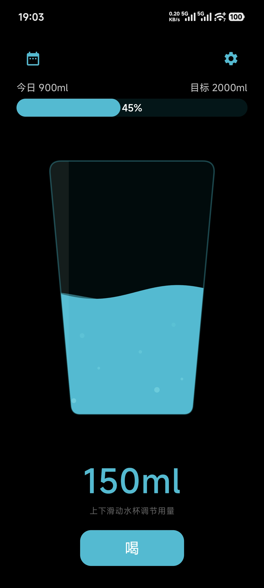
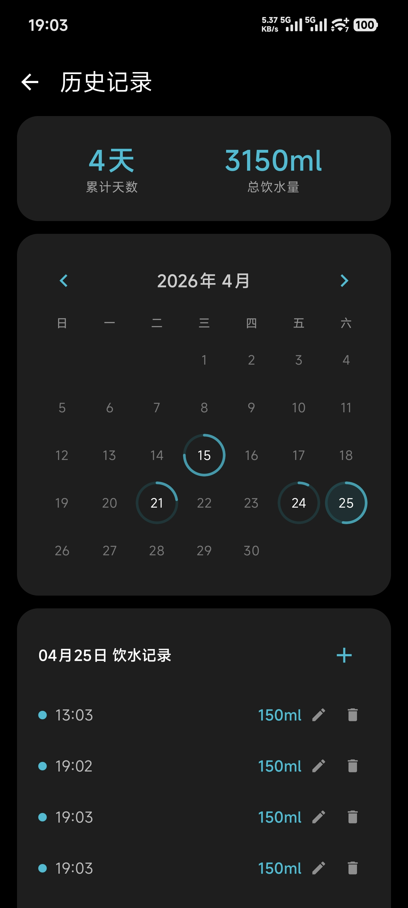
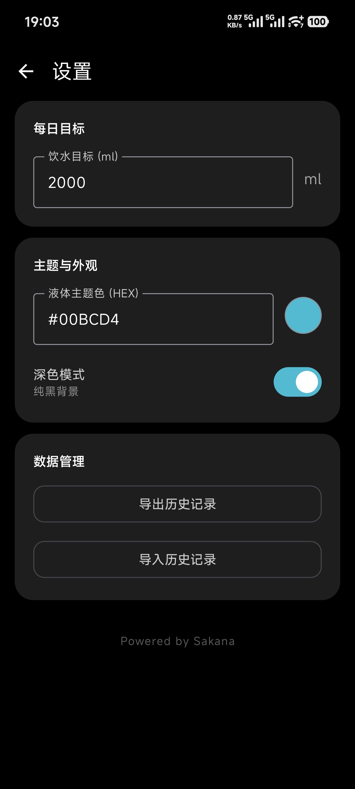

# 喝 

一款基于 Kotlin 开发的 Android 原生极简饮水记录 App。专注于丝滑的流体物理动画与直观的交互体验。

## ✨ 核心特性

- **简洁**：没有任何多余功能，不用联网，不用付费，快速记录。
- **动态流体交互**：主界面展示 2D 水杯容器，实时渲染正弦波浪及杯底上升气泡特效。
- **手势与触觉反馈**：支持通过上下滑动液面动态调节单次饮水量（10ml - 300ml）。内置动态震动算法，调节水量越大，手机震感越强。
- **进度可视化日历**：月度日历采用圆环进度条（Circular Progress）设计，直观展示每日目标达成率。支持查看及回溯修改单日历史明细。
- **高度自定义主题**：
  - 支持 **Hex 色值输入**，随心定义液体与 UI 主题色。
  - 完美适配 **深色模式 (Dark Mode)** 与浅色模式。
- **本地数据管理**：支持将饮水记录导出为表格文件（.csv），或从本地文件导入历史数据。

## 🚀 快速开始

请按以下步骤安装：

1. 打开本项目 GitHub 页面的 [Releases]([https://github.com/your-username/drink-app/releases](https://github.com/setsailhuan/sakana-He/releases)) 标签页。
2. 下载最新版本的 `app-release.apk` 文件。
3. 将 APK 传输至您的安卓手机，并允许“安装未知来源应用”后进行安装即可。

## 📸 效果预览

| 主界面| 历史记录 | 设置 |
| :---: | :---: | :---: |
|  |  |  |

---
*Powered by Sakana*
